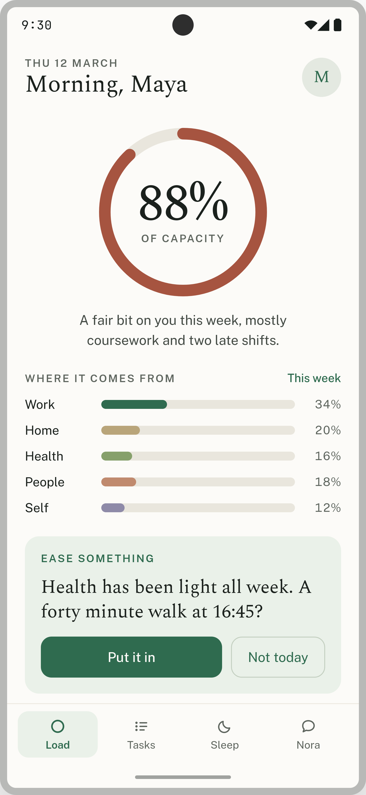
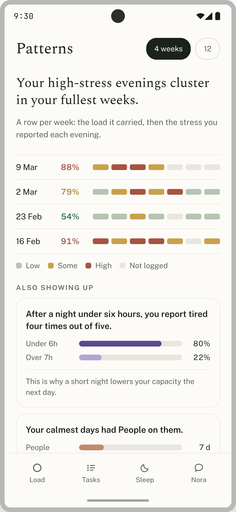
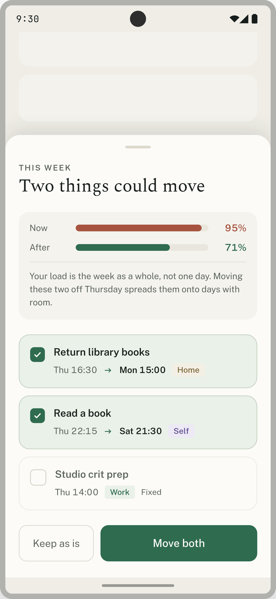
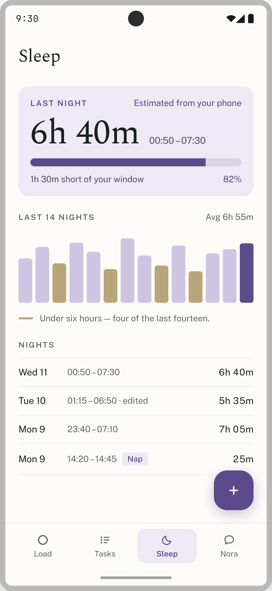
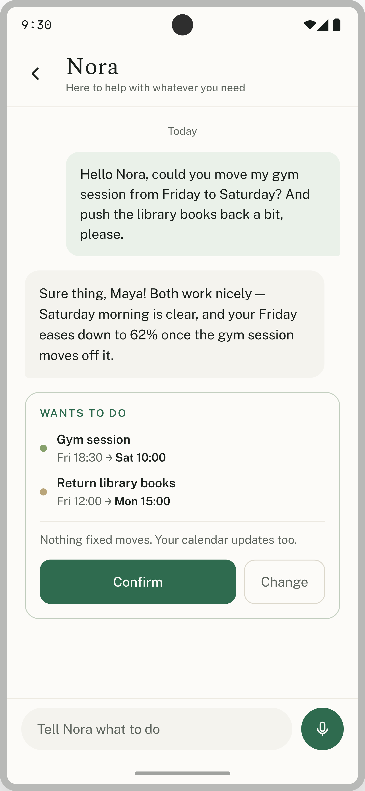

# **Easeful by Penguin Powered**

**Team:** Amr Abdelrahman, Khan Shams, Mohamed Osman, Mazin Abubaker

**Problem Statement:** Stress & Workload Manager

**Video Presentation:** https://www.youtube.com/watch?v=U1NYWmgALYU

**Presentation Slides:** https://claude.ai/code/artifact/f42a71d6-0aa9-4fd1-a657-14040d1f5500

## **1\. Project Overview**

### **The Problem**

University students rarely burn out from a single crisis. They burn out from accumulation: an assignment due Thursday, a closing shift on Friday, a friend's birthday, a GP appointment they've rescheduled twice, laundry that's been sitting for a week, and a sleep debt they stopped counting. Each item is individually reasonable. The pile is not.

**The causes, as we understand them:**

- **No visibility of total load.** Students can see their calendar and their to-do list, but neither tells them *how much they are carrying*. A calendar shows when things happen, not what they cost. A task list shows what's left, not whether it's survivable.
- **No sense of which area is overloaded.** Load is not one number. A week can be light on coursework and crushing socially, or physically fine and mentally wrecked. Without that breakdown, students can't tell what to cut, so they cut nothing.
- **Commitments are accepted one at a time.** Saying yes to any single thing always looks affordable in isolation. The cost only appears in aggregate, by which point it's already booked.
- **Low-urgency things get deferred indefinitely.** Rest, errands, admin, and health appointments are the first to slide because nothing breaks immediately when they do — they just accrue.
- **Recovery is treated as a reward, not a requirement.** Rest is what you do *after* you finish, and students never finish.

**Stakeholders:**

| Stakeholder | Stake |
| :---- | :---- |
| Undergraduate students, especially those working part-time or commuting | Primary users. Bear the direct cost: grades, health, dropped commitments, burnout. |
| University wellbeing and counselling services | Meet students at crisis point rather than during accumulation; chronically oversubscribed. |
| Academic staff and personal tutors | Absorb the downstream effects — missed deadlines, extension requests, disengagement. |
| Employers of student part-timers | Late cancellations, no-shows, turnover. |
| Friends, partners, family | Cancelled plans, absorbed emotional load, often the first to notice before the student does. |

**Similar apps and why they fall short:**

- **Todoist / Google Tasks / Microsoft To Do.** Excellent at capture, blind to capacity. Every task is a checkbox of equal weight, so an empty list is the only success state and adding "one more thing" is always free. They will happily let a student schedule fourteen hours of work into a Tuesday without comment.
- **Daylio / Bearable (mood and symptom trackers).** These log how you feel and draw you a chart. The chart is retrospective and inert — it tells you that last week was bad after last week is over, and it has no connection to the commitments that made it bad. Insight without a lever.
- **Reclaim.ai / Motion (AI auto-schedulers).** The closest technically, but they optimise for the opposite goal: fitting *more* into the day. They're built for knowledge workers with a single professional calendar, priced accordingly, and their idea of a good week is a densely packed one. Nothing in them models "you should be doing less."
- **Finch / Headspace (self-care and wellbeing apps).** Good at nudging toward rest, but completely decoupled from the student's actual obligations. They suggest a breathing exercise without knowing you have three deadlines on Friday, so the suggestion lands as one more thing on the list.

The gap is consistent: **the trackers don't act, the schedulers act in the wrong direction, and the wellbeing apps act without context.** Nothing sits in the middle and says "here is everything you're carrying, here is which part is too heavy, and here is what to move."

### **Our Solution**

Easeful is an Android app that shows university students their *whole* load — across work, home, health, people, and self — as a single weekly capacity figure, then actively helps them bring it back down. Instead of a to-do list that grows without limit, it models each week as a finite budget shaped by the student's own stress, energy, and sleep, and warns them as it fills. When a week runs hot, Easeful doesn't just report it: it proposes concrete reschedules of the tasks the student marked flexible, and suggests recovery — a nap, an earlier night, time in an area of life that's been squeezed out. Nora, the built-in assistant, lets students do all of this by talking instead of tapping through forms, and always asks before it changes anything.

**Feature set:**

- **Daily check-in** — two taps at the end of the day: stress (low / medium / high) and energy (tired / okay / energized). Deliberately the smallest possible input, because a check-in that takes effort is a check-in that stops happening.
- **Load visualizer** — a weekly capacity ring ("you're at 87% this week"), a breakdown of load by category, and a trend line across the week. Also available as a home-screen widget, so the number is visible without opening the app.
- **Task manager** — tasks grouped into five life categories, each marked **fixed or flexible** and given a three-level priority from *want* to *must*. This is what makes rebalancing possible: the app knows exactly what it is allowed to move.
- **Reschedule suggestions** — when the week is overloaded, Easeful proposes moving specific flexible, low-priority tasks to specific lighter slots, avoiding calendar conflicts and protected sleep time.
- **Easing suggestions** — recovery prompts tuned to what's actually missing, not generic self-care. If *People* and *Self* have been at zero for a week while *Work* is at capacity, that's what it addresses.
- **Sleep manager** — log sleeps and naps, see sleep across time, and get sleep timing suggestions that account for the next morning's fixed commitments.
- **Nora, the AI assistant** — voice or text. "I just got given a shift on Saturday" adds the task, recalculates the week, and reports the damage. Nora *performs* actions rather than describing them, and confirms with the user before executing any of them.
- **Calendar and Health Connect integration** — existing commitments and sleep data flow in automatically, so the student isn't re-entering their life by hand.
- **Notifications** — end-of-day check-in, task start, and sleep logging on wake. Three, all tied to a moment that already exists in the day.

**Our philosophy, and the reason the app looks the way it does:** weekly load matters more than daily load. A brutal Tuesday is survivable; four mediocre weeks in a row is what breaks people. Everything in Easeful — the capacity ring, the trend, the rescheduling window — is scoped to the week for that reason. The interface is deliberately sparse, light by default with a soft green accent, because an app about being overwhelmed cannot itself be overwhelming.

## **2\. Ideation & Process**

### **2.1 Ideas We Considered**

| Idea | Why it was dropped / kept |
| :---- | :---- |
| **Weekly capacity ring & category load visualizer** (Chosen) | **Kept.** Became the core of the product. It's the one thing no existing app gives students — a single honest answer to "how much am I carrying right now?" — and it's what every other feature feeds into or acts on. |
| **Task manager with fixed/flexible + 3-level priority** (Chosen) | **Kept.** Started as a plain to-do list, which added nothing over Todoist. The fixed/flexible and want→must dimensions were added specifically so the app has permission and information to rebalance a week. Without them, rescheduling is guesswork. |
| **Lightweight daily check-in (stress + energy)** (Chosen) | **Kept,** but cut down hard. Early versions had more granular scales and more questions. We reduced it to two three-point taps: anything longer gets abandoned within a week, and coarse data that actually gets collected beats fine data that doesn't. |
| **Reschedule & easing suggestions** (Chosen) | **Kept.** This is what separates us from trackers. The brief was explicit that the app shouldn't just track and report, so the visualizer always has an action attached to it. |
| **Sleep manager with naps** (Chosen) | **Kept.** Sleep is both an input to capacity and an output of overload, so it earns its place twice. Naps included because student sleep is rarely a single clean block. |
| **Nora, the AI assistant** (Chosen) | **Kept,** but re-scoped. Originally conceived as a chatbot you'd talk to about how you're feeling — which we dropped, as it duplicated existing wellbeing apps and risked the app pretending to be a therapist. Rebuilt as an *action* layer: Nora edits tasks, logs sleep, and reshuffles the week on request, with confirmation before every write. |
| **Calendar & Health Connect integration** (Chosen) | **Kept, narrowly.** Reading the device calendar is essential — without it the capacity figure ignores half the student's life. Health Connect is scoped to sleep only, not the broad fitness integration we first sketched (see below). |
| **Home-screen load widget** (Chosen) | **Kept.** The insight is only useful if it's seen before saying yes to something, not after opening the app. A widget puts the number where the decision happens. |
| Habit tracker (streaks, daily habits) | **Dropped.** Streak mechanics punish exactly the weeks our users need help most — miss a day during a crunch and the app makes you feel worse. Fundamentally at odds with the philosophy. |
| Food / nutrition tracker | **Dropped.** High-friction daily logging for data that barely moves our load model, and meal logging carries real risk for users with disordered eating. Out of scope, and not ours to handle responsibly. |
| Step counter & activity tracking | **Dropped.** Solved comprehensively by the phone and by every fitness app already installed. Adding it would have meant competing on a feature nobody is asking us for. |
| Broad health-app integration (full fitness/vitals sync) | **Dropped to a narrow scope.** Widening permissions raised a real barrier at install ("why does a task app want my heart rate?") for marginal gain. Reduced to sleep data via Health Connect only. |
| Social / accountability features (shared load, friend check-ins) | **Dropped.** Making your workload visible to peers turns a stress management tool into a comparison engine. Wrong incentive for a burnout app. |
| Paid "Plus" tier (20 Nora messages/month for $3) | **Designed, deliberately out of scope for the hackathon.** Documented as the business model; the build ships free-tier only (5 Nora messages/day) so judging is on the product, not a paywall. |

### **2.2 Ideation Boards**

*Mindmap. Where the five-category model came from. The brief named five areas (mental, time, physical, social, errands) and none of them survived intact: physical and mental merged into Health because a run of bad nights reads as both, time stopped being a category at all and became the capacity model, and Self was added because nothing in the brief covered unstructured time — which turned out to be the first thing to disappear from a heavy week, and the reason easing suggestions exist. The cut branches at the bottom are the ideas we killed and why.*


*Problem tree. Effects at the top, the core problem in the trunk, causes below, and a "why" under each cause. Reading it bottom-up is what produced the framing the whole product rests on — burnout as accumulation rather than crisis — and the root line is the sentence we kept coming back to when scoping. The rule in the bottom-right became our filter for the feature set: a cause with no feature pointed at it was a cause we hadn't really accepted, and a feature that didn't answer a cause got cut.*

### **2.3 Mentor Consultation**

| Date | Mentor | Feedback Received | What Was Changed |
| :---- | :---- | :---- | :---- |
| 13 Sep | Faris Imran | Too much text on screen. Walking through the prototype, the recurring note was density — screens were explaining themselves in sentences where the interface should be doing the work. Particularly flagged: the capacity view, where supporting copy competed with the number it was supporting. | Cut copy throughout. The capacity ring now carries the message on its own — a percentage and a category breakdown, with the explanatory sentence removed. Reschedule and easing suggestions were reduced to a single line naming the task and the change, plus accept/dismiss. Headings shortened, helper text under inputs deleted where the control was self-evident. |
| 13 Sep | Faris Imran | Notification design was the right call. Positive on the decision to ship only three notifications — check-in, task start, sleep logging — and specifically on anchoring each to a moment that already exists in the user's day rather than firing on an arbitrary schedule. | Kept as designed, and treated as a constraint rather than a starting point. We had been considering an overload warning as a fourth notification; this feedback settled it — the warning surfaces in the widget and in-app instead, so the notification count stays at three. |

## **3\. Design & Prototype**

**UI Prototype:** https://claude.ai/code/artifact/919312a7-725c-48e5-a89e-b52550b0201a

**Design language.** Minimalist, light theme by default, with a soft green accent and a classical serif for headings. Dark mode toggleable.


*Home. The capacity ring is the first and largest thing on screen; the percentage is the sanity check. Beneath it, load split by category, so the user can see immediately which part of their life is the heavy one. The easing suggestion below is triggered by an underrepresented category rather than a generic wellbeing timer.*


*Daily check-in. Two rows of three taps — stress and energy — and it's done. No free text, no streak. Fires as an end-of-day notification and dismisses straight back to home.*


*Patterns view. Load across the week, because the week is the unit that matters. This is where accumulation becomes visible — the shape that a daily view hides.*


*Tasks, grouped by category. Each shows its fixed/flexible state and its want→must priority, the two properties that determine whether Easeful is allowed to move it.*


*A reschedule suggestion. Easeful names the specific task and the specific new slot, and shows what it does to the week's capacity. One tap to accept, one to dismiss — the user is never handed a scheduling problem to solve themselves.*


*Sleep. Logged on wake via notification, naps included, visualised over time. Sleep feeds the capacity calculation and is protected as a block that reschedules will not touch.*


*Nora. Voice or text in, actions out. Every action is shown as an explicit confirmation card before it's executed — nothing is written to the user's week without a yes.*

## **4\. What Makes It Different**

**Capacity as a ceiling, not a count.** Every task app we looked at treats the list as unbounded — there is always room for one more item. Easeful models the week as a finite budget derived from the user's own recent stress, energy, sleep, and age, then shows how full it is. The novel part isn't the ring; it's that the number is *personal and earned*. A week that's 70% for a well-rested user is 95% for the same user after four bad nights. No task manager we found does this at all.

**Load is computed, not summed.** Most "workload" figures are just hours added up. Ours weights by the factors that actually determine how heavy a week feels: number of tasks (fewer is better), total duration, *diversity* of categories in a day (more is better — five hours across three areas of life is easier than five hours of the same thing), spacing between tasks, and the user's recent stress and energy *for that specific category*. The diversity term is the twist: it means Easeful will sometimes tell a student to add a social plan to reduce their load, which sounds wrong and is right.

**Fixed vs flexible as a first-class property.** A two-word tag that converts an unsolvable scheduling problem into a tractable one. It's the user granting the app explicit permission over specific commitments, which is what makes automated rebalancing safe — Easeful never has to guess whether your 9am lecture is negotiable.

**Recovery suggested from the gaps, not from a timer.** Easing activities are chosen by looking for *underrepresented* categories and surfacing something from them. It's a wellbeing nudge that knows what your life actually looks like this week, rather than an interruption on a schedule.

**An assistant that does things.** Nora is not a chat companion. She's an action layer over the app's own functions: adding tasks, logging sleep, moving the week around — by voice, with a confirmation before every write. For a student walking between buildings who just got handed a shift, the difference between "tell me about it" and "done, and you're now at 94%" is the entire product.

**Weekly framing throughout.** Every competitor optimises the day. We optimise the week, on the basis that burnout is accumulated rather than triggered. It's a small-sounding design decision that changes what the app shows, what it warns about, and what it suggests.

| | Todoist | Daylio | Reclaim.ai | Finch | **Easeful** |
| :---- | :---- | :---- | :---- | :---- | :---- |
| Shows total load / capacity | ✕ | ✕ | ✕ | ✕ | **✓** |
| Breaks load down by life area | ✕ | ✕ | ✕ | ✕ | **✓** |
| Acts on overload (rebalances) | ✕ | ✕ | Packs more in | ✕ | **✓** |
| Suggests recovery in context | ✕ | ✕ | ✕ | Generic | **✓** |
| Optimises for *less* | ✕ | — | ✕ | — | **✓** |
| Built for students, free | ✓ | ✓ | ✕ | ✓ | **✓** |

## **5\. Technical Architecture & Feasibility**

### **Tech stack**

| Layer | Choice | Why | Expected constraint |
| :---- | :---- | :---- | :---- |
| Client | **Flutter** (Android) | Team already knows Dart; one codebase, and the animation and custom-painting support makes the capacity ring and trend charts straightforward without a charting dependency. | Home-screen widgets are not native Flutter — the widget needs a Kotlin/Jetpack Glance layer talking to Flutter over a shared preferences bridge. Budgeted as its own task. |
| Auth & database | **Supabase** (Postgres + Auth) | Free tier covers a hackathon comfortably, email/OAuth auth out of the box, and Postgres with row-level security means each user's data is isolated without us writing an access layer. | Free-tier projects pause after inactivity — needs a warm-up before demo. The service key never ships in the client, so all writes that require elevated access go through our API. |
| API server | **Python FastAPI** | The load and capacity scoring is the part most likely to change; keeping it server-side means we tune the model without shipping an app update. Also keeps the OpenRouter key and Nora's prompts off the device. | Adds a network hop to every recalculation. Mitigated by computing optimistically on-device for immediate UI feedback and reconciling with the server response. |
| Hosting | **Render** | Free web service, deploys from GitHub on push, zero infra work during a hackathon. | Free instances cold-start (tens of seconds) after idle. Mitigated with a scheduled keep-alive ping, and a demo warm-up in the run-through. |
| Model provider | **OpenRouter** | One key, many models, with fallback if a provider rate-limits mid-demo. Lets us start on a cheap fast model and swap if quality is short. | Per-message cost is the reason for the 5-messages-a-day free cap. Latency varies by provider — Nora shows an explicit thinking state rather than pretending to be instant. |
| Device integrations | **Health Connect**, device **Calendar** | Sleep and existing commitments without manual entry. Read-only scopes, requested at point of use rather than at install. | Health Connect availability varies by Android version and OEM; every integration path degrades gracefully to manual entry. Calendar permission is a real drop-off point, so the app is fully usable if it's refused. |

### **System architecture**

```
┌─────────────────────────────┐
│      Flutter (Android)      │
│  UI · local cache · widget  │
│  Health Connect · Calendar  │
└──────┬───────────────┬──────┘
       │ auth + reads  │ actions, scoring, Nora
       │ (RLS)         │ (HTTPS)
       ▼               ▼
┌──────────────┐  ┌──────────────────────┐
│   Supabase   │◄─┤  FastAPI  (Render)   │
│ Auth·Postgres│  │ load & capacity model│
│   Storage    │  │ reschedule engine    │
└──────────────┘  │ Nora orchestration   │
                  └──────────┬───────────┘
                             ▼
                      ┌─────────────┐
                      │ OpenRouter  │
                      └─────────────┘
```

Reads go straight from the client to Supabase under row-level security. Anything involving scoring, rescheduling, or Nora goes through FastAPI, which holds the model logic and the provider key. Nora returns a structured action proposal, never a direct database write — the client renders it as a confirmation card, and the write only happens after the user accepts.

### **Build plan & scope**

**What we will build during the building phase:**

1. Auth and onboarding (sign-up, sleep range, age, category selection).
2. Task CRUD with categories, fixed/flexible, and priority — the data model everything else depends on.
3. Daily check-in with local notification.
4. The load and capacity model in FastAPI, with the weekly ring, category breakdown, and trend view rendered in the client.
5. Sleep and nap logging with the sleep-over-time visualisation.
6. Reschedule suggestions for flexible tasks, respecting calendar conflicts and protected sleep.
7. Easing suggestions driven by underrepresented categories.
8. Nora, text-first, over a fixed set of actions (add/edit/complete task, log sleep, accept reschedule), each behind a confirmation card.
9. Calendar read integration.
10. Light and dark themes across every screen built.

**Explicitly out of scope for this phase, and why:**

- **The paid tier.** Designed and documented, not built. Payments add no value to a judged prototype.
- **Voice input for Nora.** Text first. Voice is a wrapper over the same action pipeline, so it's the first thing added if items 1–10 land early — but it's not allowed to compete with the core loop for time.
- **Health Connect sleep import.** Manual sleep logging works standalone; the import is a convenience layer and the OEM variability makes it a poor use of build-phase hours.
- **The home-screen widget.** Highest risk-to-value ratio in the list, because of the native Kotlin bridge. Scheduled last, and dropped without hesitation if it threatens anything above it.
- **iOS.** Android only, as stated up front.

We would rather demo eight features that work than fourteen that half-work, and the ordering above is the order we will cut from if we run short.
